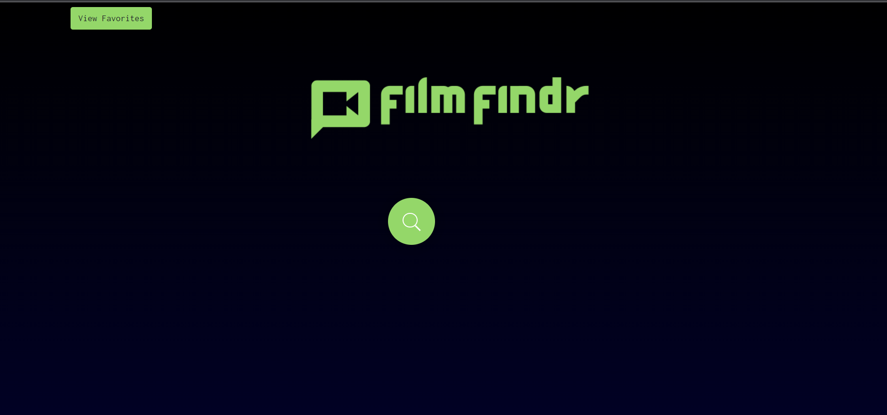
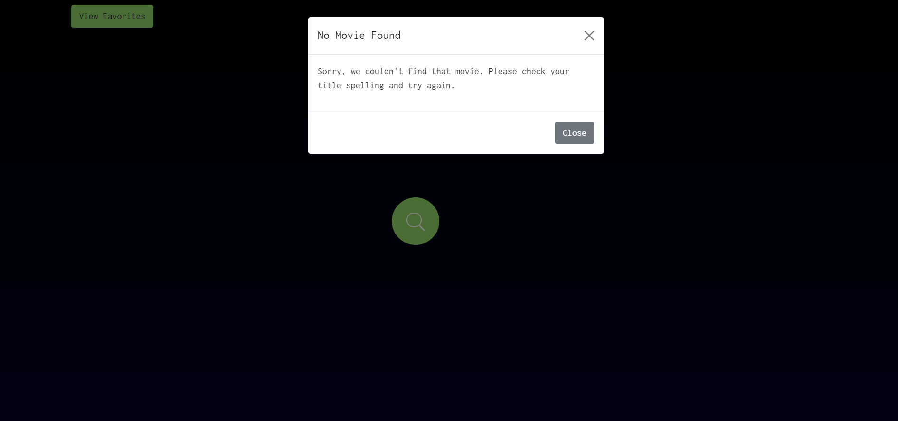
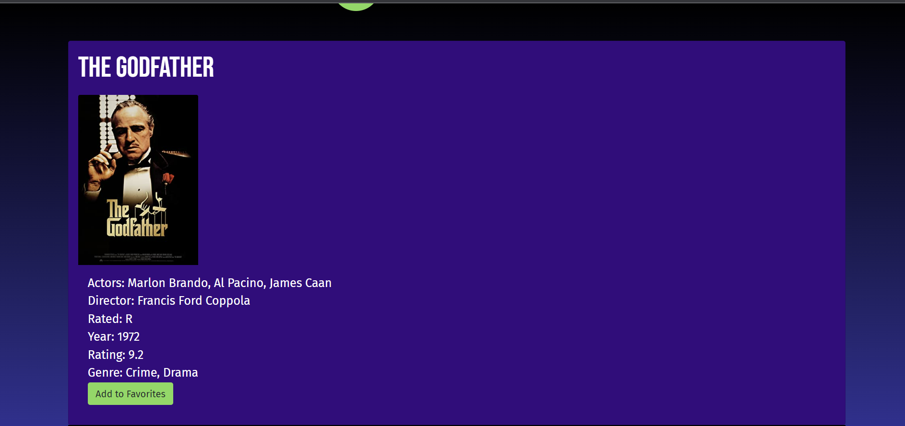
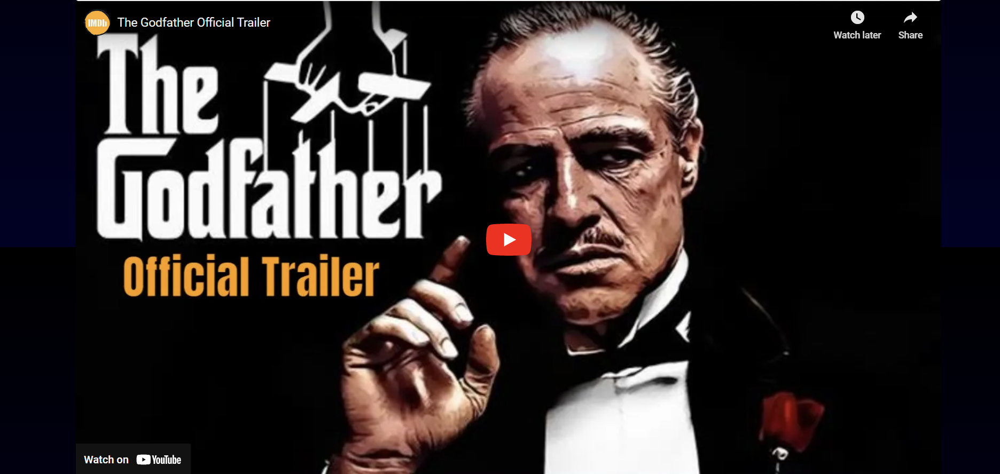
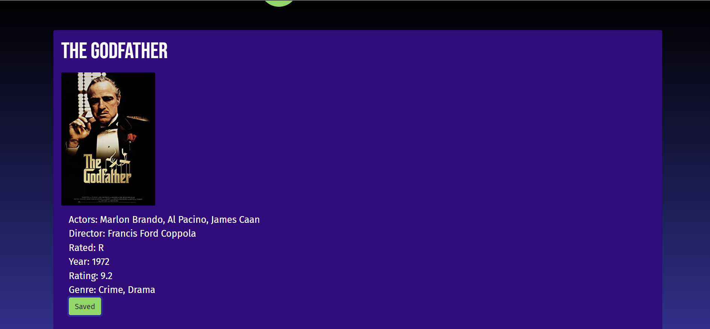
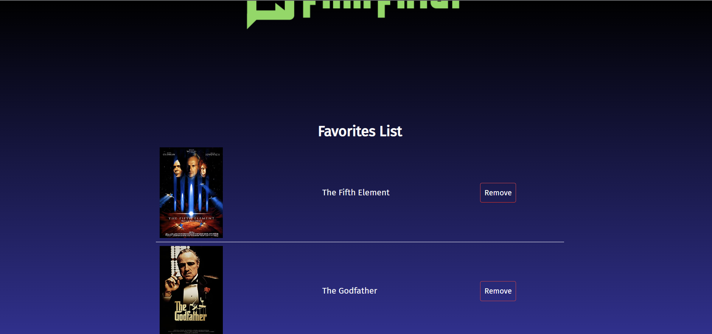
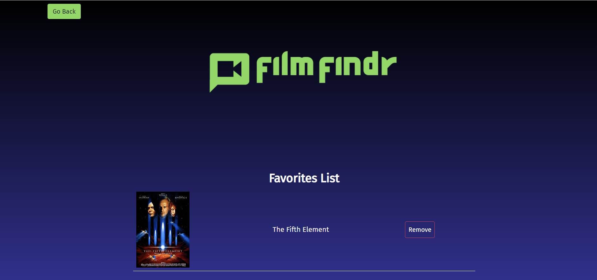

# FilmFindr

## Description
The crew who worked on filmFindr wanted to give the user the ability to pull movie previews and information from a search bar and save their favorites to a personalized list. FilmFindr gives people a convenient way to access their favorited list with a click of a button from the homescreen. This solves the issues of having to look up movie titles and their previews on separate applications. While we worked on this project, we learned how to fetch API's and incorporate them into a working app using JavaScript, CSS, Bootstrap, and HTML. Aside from the technical learning, we learned how to work within a group and divide up tasks, compromise our ideas to create a cohesive application, and work under time restrictions with our personal work schedules. 

## Usage

To use filmFindr the user searches a movie title of their choice and the app will pull results from the OMDB and Youtube API. This will open a results section showing the movie title, poster, actor, director, rating, plus other information from OMBD and the movie preview from Youtube. The user can favorite a movie, by pressing the "Add to favorites" button, which will then save the information and add it to their favorite list in a separate section. The user can navigate to their favorites list and view all the previous movies they favorited. To view the movie information and preview again, the user can click their favorited movie and the app will bring them to the movie's information page. The user can delete the favorited movie from their list by clicking the "remove" button. 

## Credits

Mike Johnson: https://github.com/MikeWebPrint
Ama Frema: https://github.com/Afrema90
Raied Abdelgani: https://github.com/raiedab
Kevin Bell: https://github.com/gitkcb

